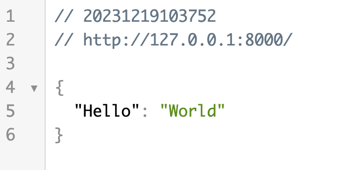

## FastAPI 安装
FastAPI 依赖 Python 3.8 及更高版本。

安装 FastAPI 很简单，这里我们使用 pip 命令来安装。
```python
pip install fastapi
```
另外我们还需要一个 ASGI 服务器，生产环境可以使用 Uvicorn 或者 Hypercorn：
```python
pip install "uvicorn[standard]"
```
这样我们就安装完成了。

### 运行第一个 FastAPI 应用
创建一个名为 main.py 的文件，添加以下代码：

实例
```python
from fastapi import FastAPI

app = FastAPI()

@app.get("/")
def read_root():
    return {"Hello": "World"}
```

在命令行中运行以下命令以启动应用：

```python
uvicorn main:app --reload
```
现在，打开浏览器并访问 http://127.0.0.1:8000，你应该能够看到 FastAPI 自动生成的交互式文档，并在根路径 ("/") 返回的 JSON 响应。



代码解析：

from fastapi import FastAPI： 这行代码从< code>fastapi 模块中导入了 FastAPI 类。FastAPI 类是 FastAPI 框架的核心，用于创建 FastAPI 应用程序实例。

app = FastAPI()：这行代码创建了一个 FastAPI 应用实例。与 Flask 不同，FastAPI 不需要传递 __name__ 参数，因为它默认使用当前模块。

@app.get("/")： 这是一个装饰器，用于告诉 FastAPI 哪个 URL 应该触发下面的函数，并且指定了 HTTP 方法为 GET。在这个例子中，它指定了根 URL（即网站的主页）。

def read_root():： 这是定义了一个名为 read_root 的函数，它将被调用当用户使用 GET 方法访问根 URL 时。

return {"Hello": "World"}： 这行代码是 read_root 函数的返回值。当用户使用 GET 方法访问根 URL 时，这个 JSON 对象将被发送回用户的浏览器或 API 客户端。