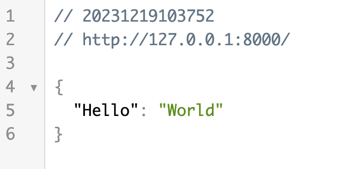

## 第一个 FastAPI 应用
创建一个名为 main.py 的文件，添加以下代码：

实例
```python
from fastapi import FastAPI

app = FastAPI()

@app.get("/")
def read_root():
    return {"Hello": "World"}
```
在命令行中运行以下命令以启动应用：
```shell
uvicorn main:app --reload
```
现在，打开浏览器并访问 http://127.0.0.1:8000，你应该能够看到 FastAPI 自动生成的交互式文档，并在根路径 ("/") 返回的 JSON 响应。



接下来我们来丰富下代码功能，并做具体说明。

以下的 FastAPI 应用，使用了两个路由操作（/ 和 /items/{item_id}）：

实例
```python
from typing import Union

from fastapi import FastAPI

app = FastAPI()


@app.get("/")
def read_root():
    return {"Hello": "World"}


@app.get("/items/{item_id}")
def read_item(item_id: int, q: Union[str, None] = None):
    return {"item_id": item_id, "q": q}
```

### 代码拆解分析
 - 1、导入必要的模块和类：
```python
from typing import Union
from fastapi import FastAPI
```
以上实例导入了 Union 类型，用于支持多种数据类型的参数注解。

 - 2、创建 FastAPI 实例：
```python
app = FastAPI()
```
在这一步，创建了一个 FastAPI 应用的实例，它将用于定义和管理应用的各个组件，包括路由。

FastAPI 是 FastAPI 框架的主要类。

- 3、定义根路径 / 的路由操作：
```python
@app.get("/")
def read_root():
    return {"Hello": "World"}
```
这个路由操作使用了 @app.get("/") 装饰器，表示当用户通过 HTTP GET 请求访问根路径时，将执行 read_root 函数。函数返回一个包含 {"Hello": "World"} 的字典，这个字典会被 FastAPI 自动转换为 JSON 格式并返回给用户。

 - 4、定义带路径参数和查询参数的路由操作：
```python
@app.get("/items/{item_id}")
def read_item(item_id: int, q: Union[str, None] = None):
    return {"item_id": item_id, "q": q}
```
这个路由操作使用了 @app.get("/items/{item_id}") 装饰器，表示当用户通过 HTTP GET 请求访问 /items/{item_id} 路径时，将执行 read_item 函数。

函数接受两个参数：

item_id --是路径参数，指定为整数类型。
q -- 是查询参数，指定为字符串类型或空（None）。
函数返回一个字典，包含传入的 item_id 和 q 参数。

q 参数通过 Union[str, None] 表示可以是字符串类型或空，这样就允许在请求中不提供 q 参数。

使用浏览器访问 http://127.0.0.1:8000/items/5?q=runoob，你将会看到如下 JSON 响应：

{"item_id": 5, "q": "runoob"}
如下图所示：

