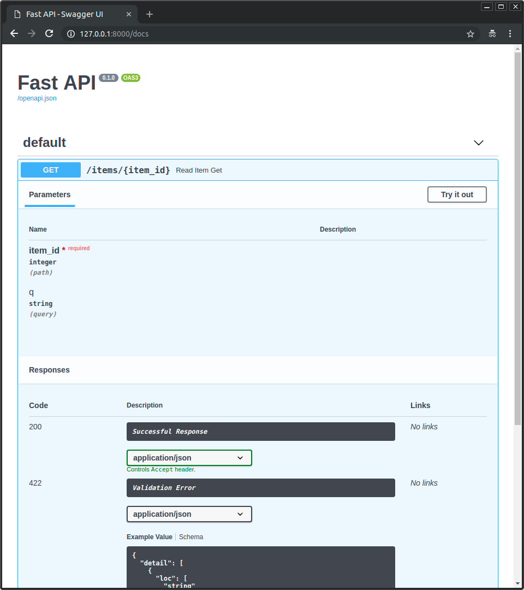
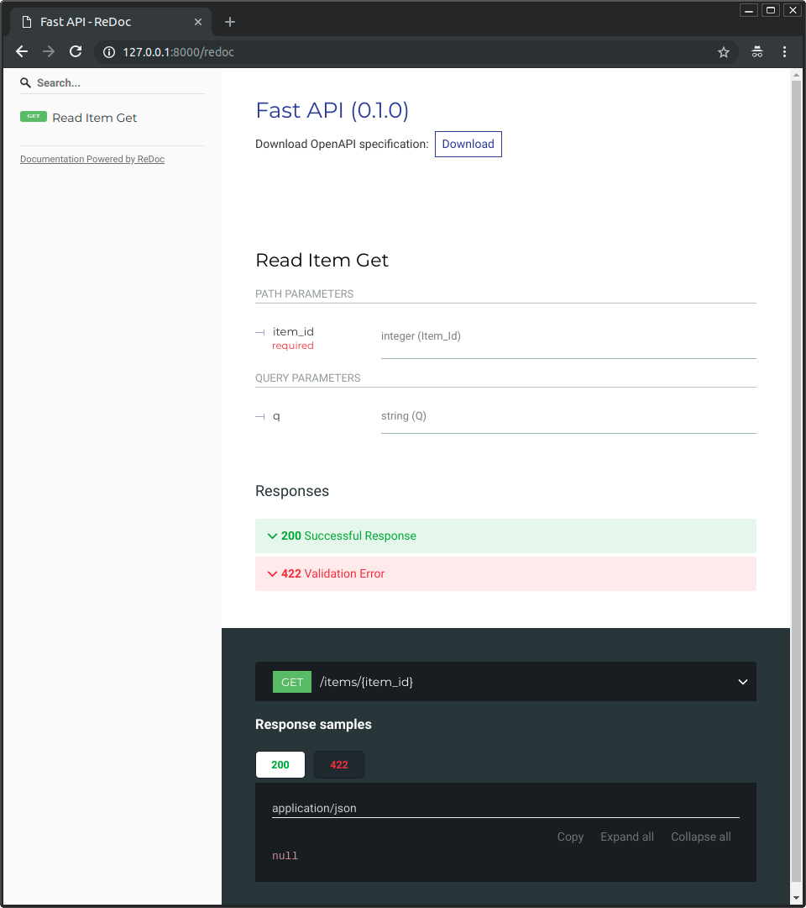
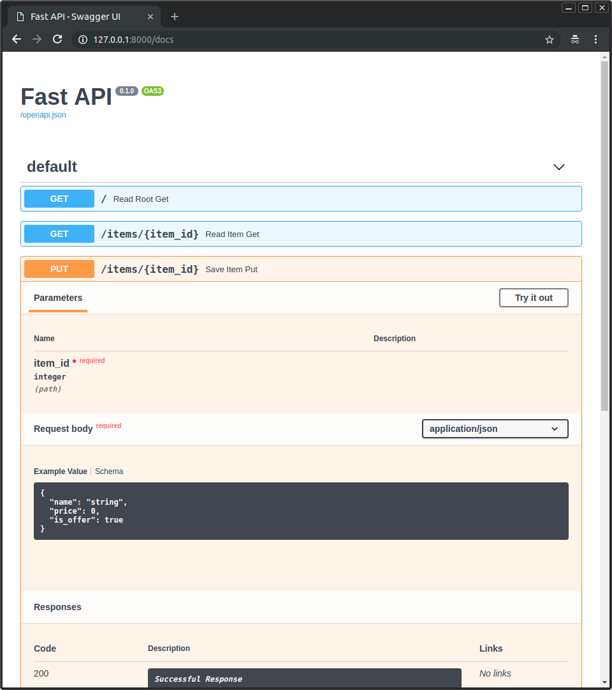
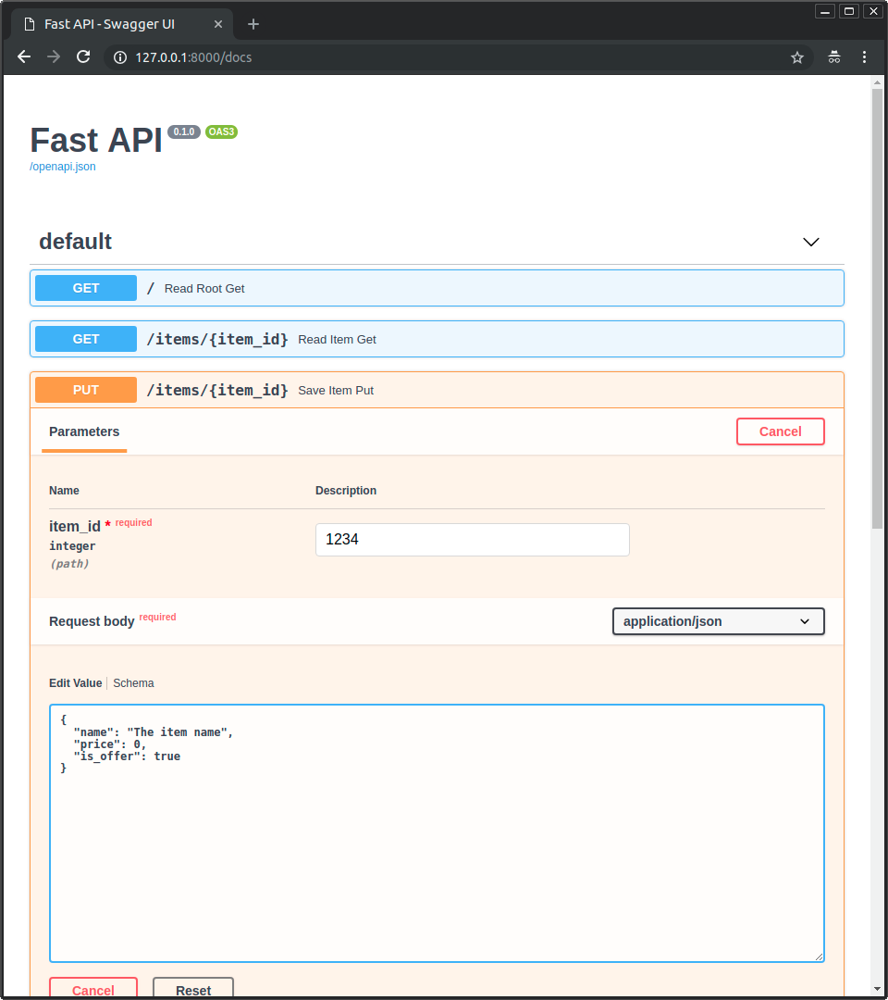
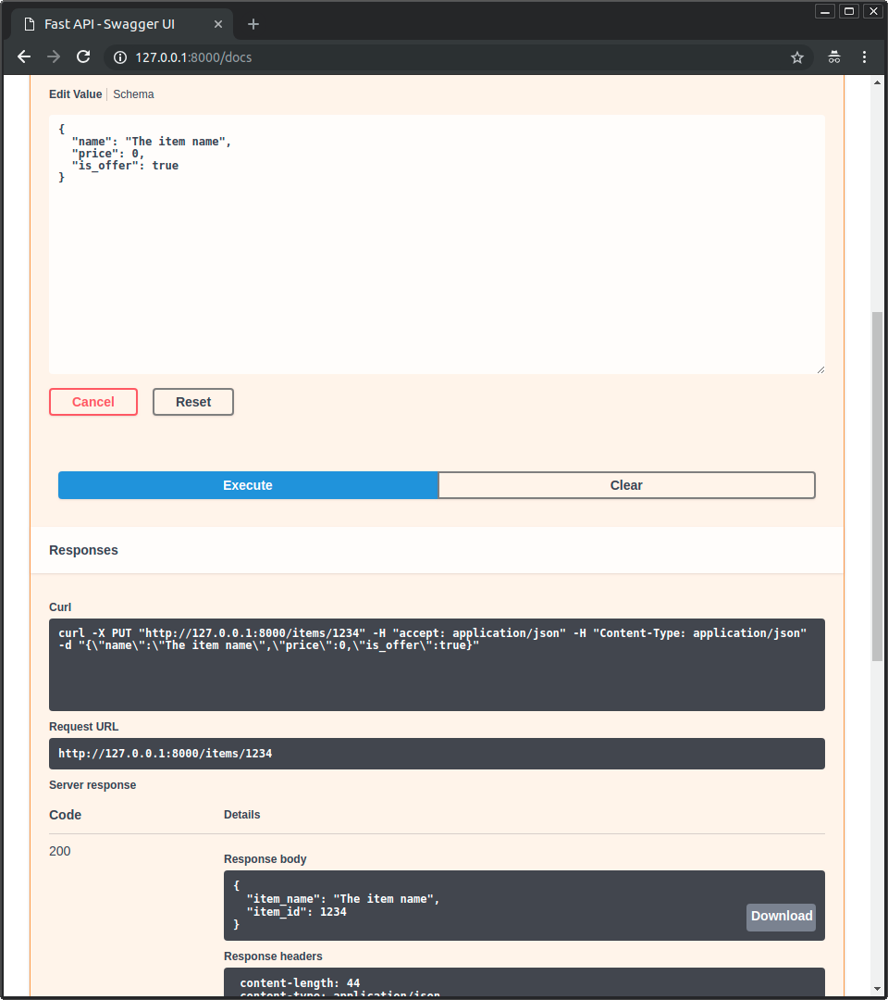
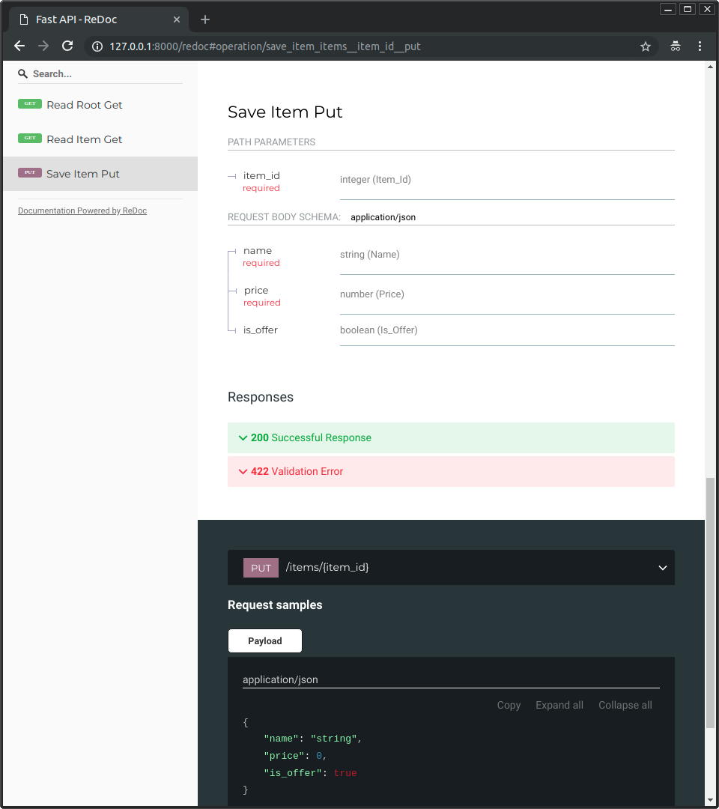

## FastAPI 交互式 API 文档
FastAPI 提供了内置的交互式 API 文档，使开发者能够轻松了解和测试 API 的各个端点。

这个文档是自动生成的，基于 OpenAPI 规范，支持 Swagger UI 和 ReDoc 两种交互式界面。

通过 FastAPI 的交互式 API 文档，开发者能够更轻松地理解和使用 API，提高开发效率

在运行 FastAPI 应用时，Uvicorn 同时启动了交互式 API 文档服务。

默认情况下，你可以通过访问 http://127.0.0.1:8000/docs 来打开 Swagger UI 风格的文档：



Swagger UI 提供了一个直观的用户界面，用于浏览 API 的各个端点、查看请求和响应的结构，并支持直接在文档中进行 API 请求测试。通过 Swagger UI，你可以轻松理解每个路由操作的输入参数、输出格式和请求示例。

或者通过 http://127.0.0.1:8000/redoc 来打开 ReDoc 风格的文档。



ReDoc 是另一种交互式文档界面，具有清晰简洁的外观。它使得开发者能够以可读性强的方式查看 API 的描述、请求和响应。与 Swagger UI 不同，ReDoc 的设计强调文档的可视化和用户体验。

交互式文档的优势
实时更新： 交互式文档会实时更新，反映出应用代码的最新更改。
自动验证： 输入参数的类型和格式会得到自动验证，降低了错误的可能性。
便于测试： 可以直接在文档中进行 API 请求测试，避免使用其他工具。
## 升级实例
接下来我们修改 main.py 文件来从 PUT 请求中接收请求体。

我们借助 Pydantic 来使用标准的 Python 类型声明请求体。

实例
```python
from typing import Union

from fastapi import FastAPI
from pydantic import BaseModel

app = FastAPI()


class Item(BaseModel):
    name: str
    price: float
    is_offer: Union[bool, None] = None


@app.get("/")
def read_root():
    return {"Hello": "World"}


@app.get("/items/{item_id}")
def read_item(item_id: int, q: Union[str, None] = None):
    return {"item_id": item_id, "q": q}


@app.put("/items/{item_id}")
def update_item(item_id: int, item: Item):
    return {"item_name": item.name, "item_id": item_id}
```
修改完代码后，我们不需要重启服务器，因为服务器将会自动重载，因为在前面的章节中 uvicorn 命令添加了 --reload 选项。

这时候我们再访问 http://127.0.0.1:8000/docs，交互式 API 文档将会自动更新，并加入新的请求体：



点击「Try it out」按钮，之后你可以填写参数并直接调用 API：



然后点击「Execute」按钮，用户界面将会和 API 进行通信，发送参数，获取结果并在屏幕上展示：



另外，访问 http://127.0.0.1:8000/redoc，可选文档同样会体现新加入的请求参数和请求体：


