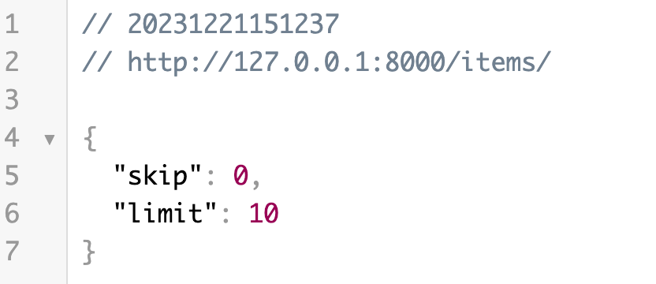
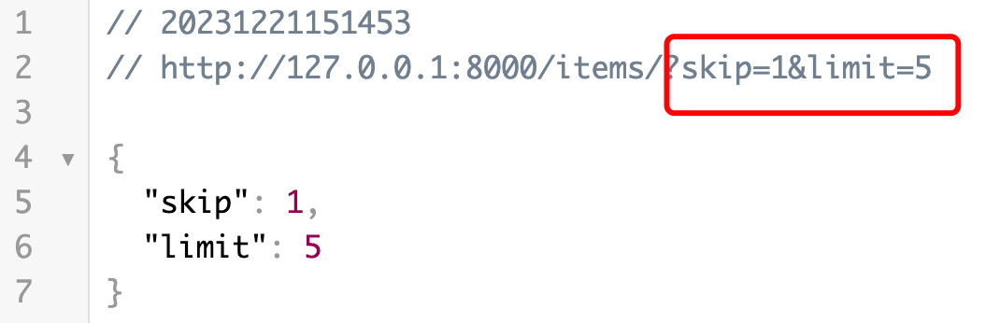
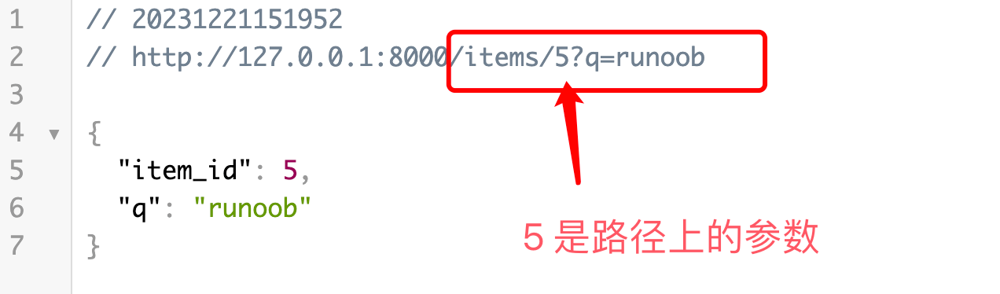
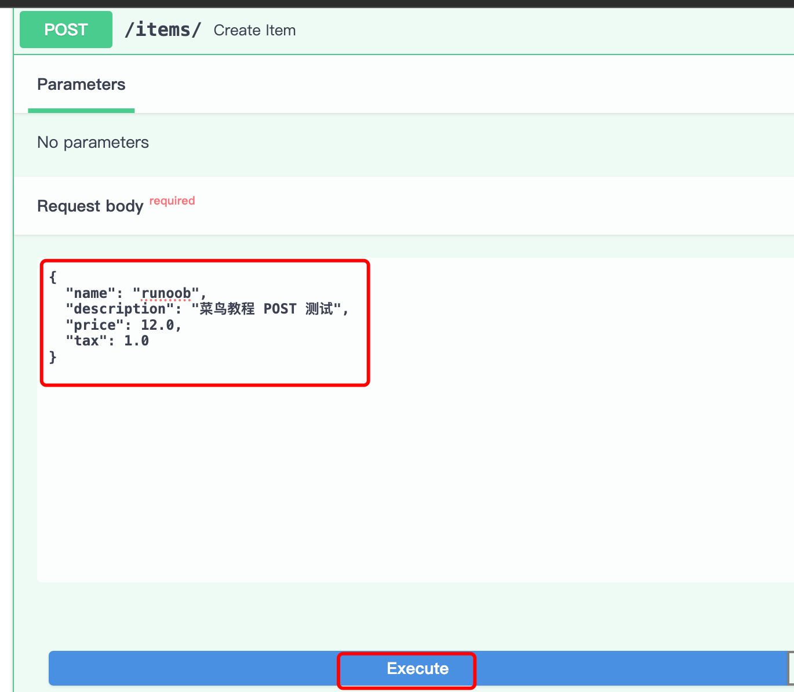
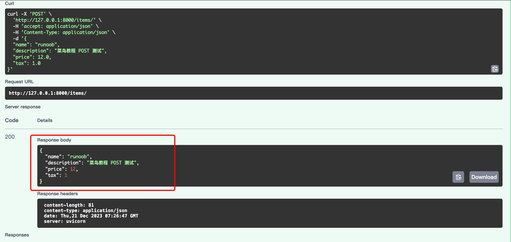
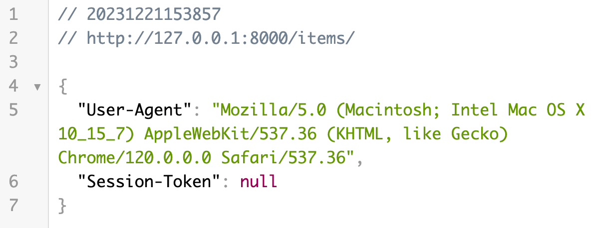
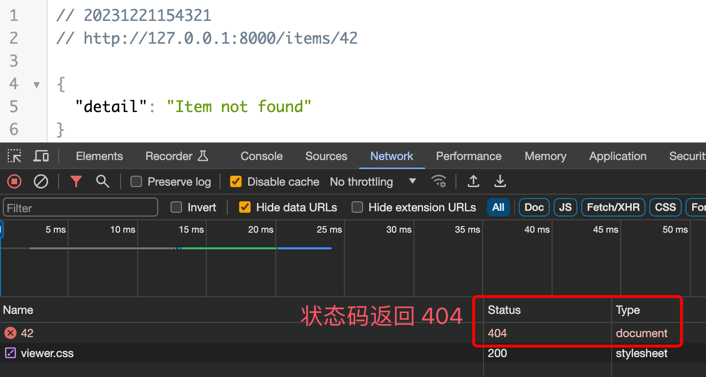
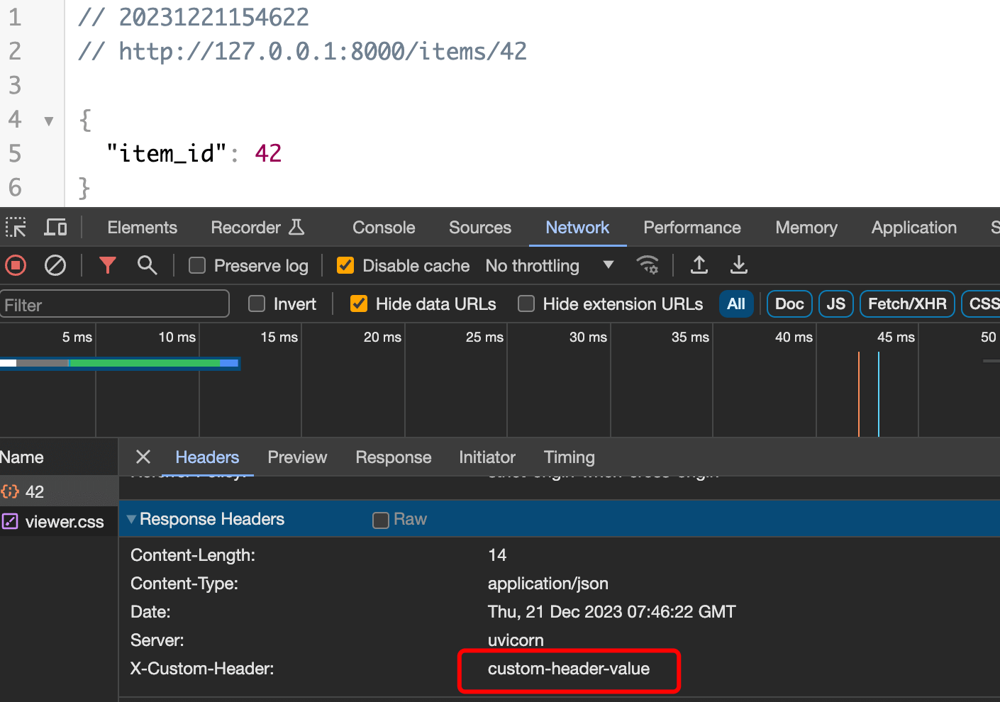

# FastAPI 请求和响应
在 FastAPI 中，请求（Request）和响应（Response）是与客户端交互的核心。

FastAPI 提供了强大的工具来解析请求数据，并根据需要生成规范的响应。

接下来我们来详细看下 FastAPI 的请求和响应。

HTTP 相关内容可以参考：HTTP 请求方法。

## 请求数据
### 查询参数
以下实例中我们定义了一个 /items/ 路由，接受两个查询参数 skip 和 limit，它们的类型均为整数，默认值分别为 0 和 10。

实例
```python
from fastapi import FastAPI

app = FastAPI()

@app.get("/items/")
def read_item(skip: int = 0, limit: int = 10):
    return {"skip": skip, "limit": limit}
```
在命令行中运行以下命令以启动应用：
```
uvicorn main:app --reload
```
现在，打开浏览器并访问 http://127.0.0.1:8000/items/，返回了默认的 JSON 数据：



传递 GET 请求的参数 http://127.0.0.1:8000/items/?skip=1&limit=5，返回 JSON 数据如下所示：



路径参数
我们可以把参数设置在路径上，这样 URL 看起来更美观一些。

以下实例我们定义了一个带有路径参数 item_id 和查询参数 q 的路由。


实例
```python
from fastapi import FastAPI

app = FastAPI()

@app.get("/items/{item_id}")
def read_item(item_id: int, q: str = None):
    return {"item_id": item_id, "q": q}
```
传递 GET 请求的参数 http://127.0.0.1:8000/items/5/?q=runoob，返回 JSON 数据如下所示：


### 请求体
接下来我们创建了一个 /items/ 路由，使用 @app.post 装饰器表示这是一个处理 POST 请求的路由。

实例
```python
from pydantic import BaseModel
from fastapi import FastAPI

app = FastAPI()
class Item(BaseModel):
    name: str
    description: str = None
    price: float
    tax: float = None

@app.post("/items/")
def create_item(item: Item):
    return item
```
使用 Pydantic 模型 Item 定义了一个请求体，包含多个字段，其中一些有默认值，更多 Pydantic 介绍参考：FastAPI Pydantic 模型。

接下来我们可以打开 http://127.0.0.1:8000/docs 来进行 POST 测试：

填写请求参数：



返回结果如下：



## 响应数据
返回 JSON 数据
路由处理函数返回一个字典，该字典将被 FastAPI 自动转换为 JSON 格式，并作为响应发送给客户端：

实例
```python
from fastapi import FastAPI

app = FastAPI()

@app.get("/items/")
def read_item(skip: int = 0, limit: int = 10):
    return {"skip": skip, "limit": limit}
```
以上代码在浏览器访问 http://127.0.0.1:8000/items/，返回了 JSON 数据：


返回 Pydantic 模型
路由处理函数返回一个 Pydantic 模型实例，FastAPI 将自动将其转换为 JSON 格式，并作为响应发送给客户端：

实例
```python

from pydantic import BaseModel
from fastapi import FastAPI

app = FastAPI()
class Item(BaseModel):
    name: str
    description: str = None
    price: float
    tax: float = None

@app.post("/items/")
def create_item(item: Item):
    return item
```
POST 请求，返回的数据格式如下所示：
```JSON
{
  "name": "runoob",
  "description": "菜鸟教程 POST 测试",
  "price": 12,
  "tax": 1
}
```
## 请求头和 Cookie
使用 Header 和 Cookie 类型注解获取请求头和 Cookie 数据。

实例
```python
from fastapi import Header, Cookie
from fastapi import FastAPI

app = FastAPI()

@app.get("/items/")
def read_item(user_agent: str = Header(None), session_token: str = Cookie(None)):
    return {"User-Agent": user_agent, "Session-Token": session_token}
```
以上代码在浏览器访问 http://127.0.0.1:8000/items/，返回了 JSON 数据：



## 重定向和状态码
使用 RedirectResponse 实现重定向，将客户端重定向到 /items/ 路由。

实例
```python
from fastapi import Header, Cookie
from fastapi import FastAPI
from fastapi.responses import RedirectResponse

app = FastAPI()

@app.get("/items/")
def read_item(user_agent: str = Header(None), session_token: str = Cookie(None)):
    return {"User-Agent": user_agent, "Session-Token": session_token}

@app.get("/redirect")
def redirect():
    return RedirectResponse(url="/items/")
```
以上代码在浏览器访问 http://127.0.0.1:8000/redirect/ 会自动跳转到 http://127.0.0.1:8000/items/ 页面：


使用 HTTPException 抛出异常，返回自定义的状态码和详细信息。

以下实例在 item_id 为 42 会返回 404 状态码：

实例
```python
from fastapi import HTTPException

@app.get("/items/{item_id}")
def read_item(item_id: int):
    if item_id == 42:
        raise HTTPException(status_code=404, detail="Item not found")
    return {"item_id": item_id}
```
以上代码在浏览器访问 http://127.0.0.1:8000/items/42/ 页面显示如下：



## 自定义响应头
使用 JSONResponse 自定义响应头:
实例
```python
from fastapi import FastAPI
from fastapi.responses import JSONResponse

app = FastAPI()

@app.get("/items/{item_id}")
def read_item(item_id: int):
    content = {"item_id": item_id}
    headers = {"X-Custom-Header": "custom-header-value"}
    return JSONResponse(content=content, headers=headers)
```
以上代码在浏览器访问 http://127.0.0.1:8000/items/42/ 页面显示如下，可以看到我们自定义的响应头：

