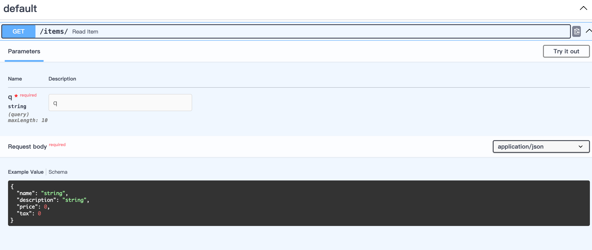
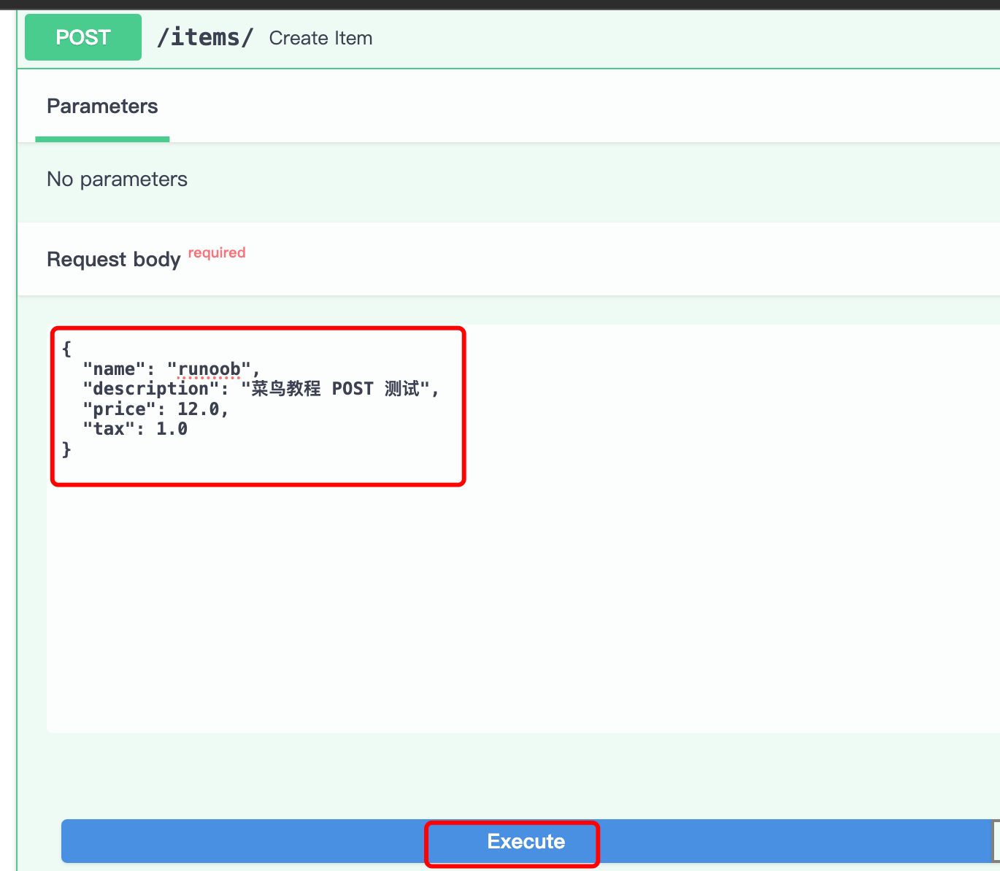
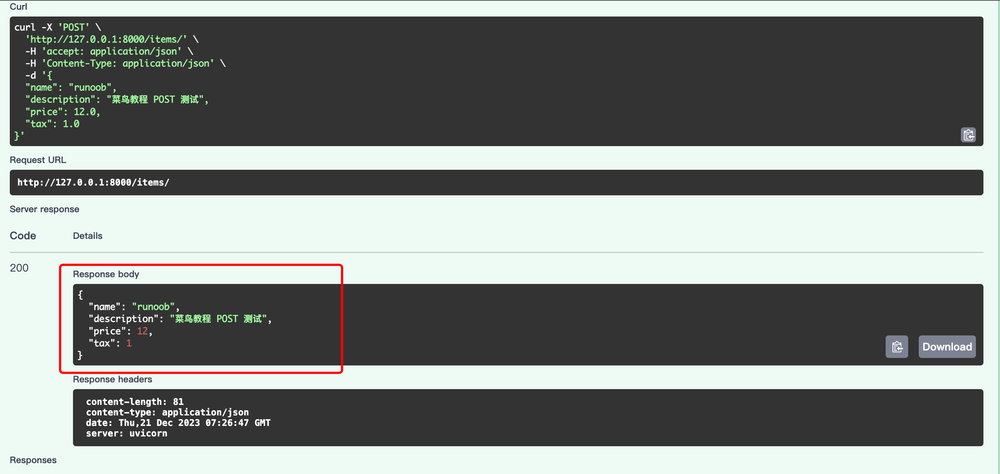

## FastAPI Pydantic 模型
Pydantic 是一个用于数据验证和序列化的 Python 模型库。

它在 FastAPI 中广泛使用，用于定义请求体、响应体和其他数据模型，提供了强大的类型检查和自动文档生成功能。

以下是关于 Pydantic 模型的详细介绍：

## 1. 定义 Pydantic 模型
使用 Pydantic 定义一个模型非常简单，只需创建一个继承自 pydantic.BaseModel 的类，并在其中定义字段。字段的类型可以是任何有效的 Python 类型，也可以是 Pydantic 内置的类型。

实例
```python
from pydantic import BaseModel

class Item(BaseModel):
    name: str
    description: str = None
    price: float
    tax: float = None
```
以上代码中中，我们定义了一个名为 Item 的 Pydantic 模型，包含了四个字段：name、description、price 和 tax，name 和 price 是必需的字段，而 description 和 tax 是可选的字段，其默认值为 None。

## 2. 使用 Pydantic 模型
### 2.1 请求体验证

在 FastAPI 中，可以将 Pydantic 模型用作请求体（Request Body），以自动验证和解析客户端发送的数据。

实例
```python
from fastapi import FastAPI
from pydantic import BaseModel

app = FastAPI()

class Item(BaseModel):
    name: str
    description: str = None
    price: float
    tax: float = None

@app.post("/items/")
def create_item(item: Item):
    return item
```
以上代码中中，create_item 路由处理函数接受一个名为 item 的参数，其类型是 Item 模型。FastAPI 将自动验证传入的 JSON 数据是否符合模型的定义，并将其转换为 Item 类型的实例。

### 2.2 查询参数验证

Pydantic 模型还可以用于验证查询参数、路径参数等。

实例
```python
from fastapi import FastAPI, Query
from pydantic import BaseModel

app = FastAPI()

class Item(BaseModel):
    name: str
    description: str = None
    price: float
    tax: float = None

@app.get("/items/")
def read_item(item: Item, q: str = Query(..., max_length=10)):
    return {"item": item, "q": q}
```
以上代码中，read_item 路由处理函数接受一个 Item 模型的实例作为查询参数，以及一个名为 q 的字符串查询参数。通过使用 Query 函数，我们还可以为查询参数指定更多的验证规则，如最大长度限制。

## 3. 自动文档生成
使用 Pydantic 模型的一个重要优势是，它能够自动为 FastAPI 生成交互式 API 文档。文档会包括模型的字段、类型、验证规则等信息，让开发者和 API 使用者能够清晰地了解如何正确使用 API。

打开 http://127.0.0.1:8000/docs，API 文档显示如下：



## 4. 数据转换和序列化
Pydantic 模型不仅提供了验证功能，还可以用于将数据转换为特定类型（例如 JSON）或反向序列化。在 FastAPI 中，这种能力是自动的，你无需手动处理。

通过使用 Pydantic 模型，你可以更轻松地定义和验证数据，使得代码更清晰、更健壮，并通过自动生成的文档提供更好的 API 交互体验。

接下来我们可以打开 http://127.0.0.1:8000/docs 来进行 POST 测试：

填写请求参数：



返回结果如下：



