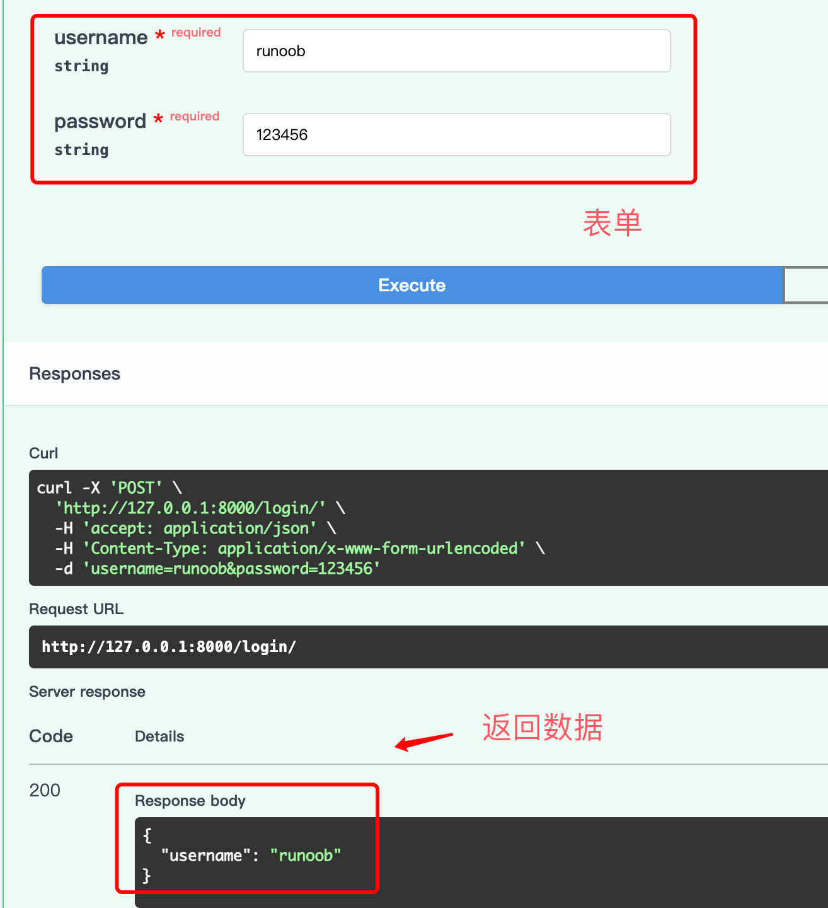
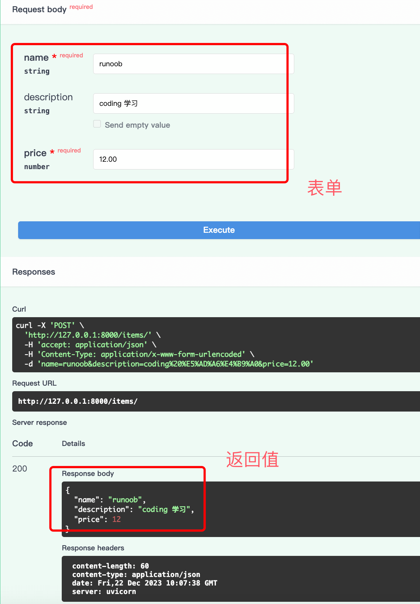
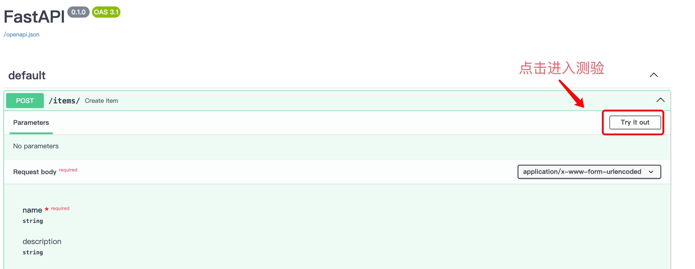
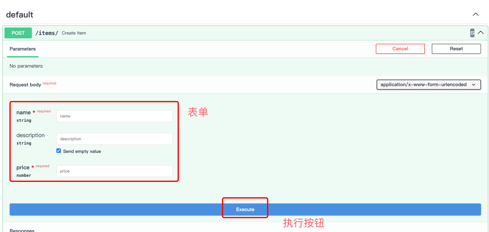

# FastAPI 表单数据
在 FastAPI 中，接收表单数据是一种常见的操作，通常用于处理用户通过 HTML 表单提交的数据。

FastAPI 提供了 Form 类型，可以用于声明和验证表单数据。

## 1、声明表单数据模型
接下来我们设计一个接收一个登陆的表单数据，要使用表单，需预先安装 python-multipart：
```python
pip install python-multipart
```
代码如下：

实例
```python
from fastapi import FastAPI, Form

app = FastAPI()


@app.post("/login/")
async def login(username: str = Form(), password: str = Form()):
    return {"username": username}
```
接下来我们可以进入 API 文档 http://127.0.0.1:8000/docs 进行测验：



使用 Pydantic 模型来声明表单数据模型。

在模型中，使用 Field 类型声明每个表单字段，并添加必要的验证规则。

实例
```python
from pydantic import BaseModel, Field

class Item(BaseModel):
    name: str = Field(..., title="Item Name", max_length=100)
    description: str = Field(None, title="Item Description", max_length=255)
    price: float = Field(..., title="Item Price", gt=0)
```
以上例子中，Item 是一个 Pydantic 模型，用于表示表单数据。

模型中的字段 name、description 和 price 分别对应表单中的不同输入项，并设置了相应的验证规则。

除了可以在 API 文档中测验，另外我们也可以自己创建 html 来测试：

实例
```html
<form action="http://localhost:8000/items/" method="post">
    <label for="name">Name:</label>
    <input type="text" id="name" name="name" required>
    <br>
    <label for="description">Description:</label>
    <textarea id="description" name="description"></textarea>
    <br>
    <label for="price">Price:</label>
    <input type="number" id="price" name="price" required min="0">
    <br>
    <button type="submit">Submit</button>
</form>
```
## 2、在路由中接收表单数据
在路由操作函数中，可以使用 Form 类型来接收表单数据。

Form 类型的参数可以与 Pydantic 模型的字段一一对应，以实现表单数据的验证和转换。

实例
```python
from fastapi import FastAPI, Form

app = FastAPI()

# 路由操作函数
@app.post("/items/")
async def create_item(
    name: str = Form(...),
    description: str = Form(None),
    price: float = Form(..., gt=0),
):
    return {"name": name, "description": description, "price": price}
```
以上例子中，create_item 路由操作函数接收了三个表单字段：name、description 和 price，这些字段与 Item 模型的相应字段一致，FastAPI 将自动根据验证规则验证表单数据。

接下来我们可以进入 API 文档 http://127.0.0.1:8000/docs 进行测验：



## 3、表单数据的验证和文档生成
使用 Pydantic 模型和 Form 类型，表单数据的验证和文档生成都是自动的。

FastAPI 将根据模型中的字段信息生成交互式 API 文档，并根据验证规则进行数据验证。

API 文档地址 http://127.0.0.1:8000/docs 。





## 4、处理文件上传
如果表单包含文件上传，可以使用 UploadFile 类型处理。

以下是一个处理文件上传的实例：

实例
```python
from fastapi import FastAPI, File, UploadFile

app = FastAPI()


# 路由操作函数
@app.post("/files/")
async def create_file(file: UploadFile = File(...)):
    return {"filename": file.filename}
```
在这个例子中，create_file 路由操作函数接收了一个 UploadFile 类型的文件参数。

FastAPI 将负责处理文件上传，并将文件的相关信息包装在 UploadFile 对象中，可以轻松地获取文件名、内容类型等信息。

通过上述方式，FastAPI 提供了一种简单而强大的方法来接收和处理表单数据，同时保持了代码的清晰性和可维护性。

