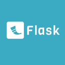

# Flask 教程

Flask 是一个用 Python 编写的轻量级 Web 应用框架。

Flask 基于 WSGI（Web Server Gateway Interface）和 Jinja2 模板引擎，旨在帮助开发者快速、简便地创建 Web 应用。


Flask 被称为"微框架"，因为它使用简单的核心，用扩展增加其他功能。

## 谁适合阅读本教程？
本教程适合有 Python 基础的开发者学习。

以下的 Flask 程序会在网页输出 Hello World ：

实例
```python
from flask import Flask
app = Flask(__name__)

@app.route("/")
def hello():
    return "Hello World!"

if __name__ == "__main__":
    app.run()
```

## 学习本教程前你需要了解
学习本教程前你需要了解一些基础的 Web 知识及 Python 3.x 基础教程。

## Flask 特点
轻量级和简洁：Flask 是一个微框架，提供了最基本的功能，不强制使用任何特定的工具或库。它的核心是简单而灵活的，允许开发者根据需要添加功能。

灵活性：Flask 提供了基本的框架结构，但没有强制性的项目布局或组件，开发者可以根据自己的需求自定义。

可扩展性：Flask 的设计允许你通过插件和扩展来添加功能。许多常见的功能，如表单处理、数据库交互和用户认证，都可以通过社区提供的扩展来实现。

内置开发服务器：Flask 内置了一个开发服务器，方便在本地进行调试和测试。

RESTful 支持：Flask 支持 RESTful API 的开发，适合构建现代的 Web 服务和应用程序。

## Flask 适用场景
小型项目：对于小型的个人项目或初创项目，Flask的简单性和灵活性可以快速启动和迭代。

原型开发：在产品开发的早期阶段，Flask可以用来快速构建原型，验证概念和用户界面。

微服务：在微服务架构中，Flask可以用来构建独立的、轻量级的服务组件。

API开发：Flask非常适合开发RESTful API，因为它的路由系统简单明了，可以轻松地定义API端点。

教育和学习：由于其易用性，Flask是学习Web开发和Python编程的优秀工具。

内部工具：Flask可以用于开发公司内部使用的工具或仪表板，这些工具通常不需要复杂的用户界面。

插件或扩展：Flask可以作为其他大型框架的插件或扩展，提供特定的功能。

定制Web应用：对于需要高度定制的Web应用，Flask提供了足够的灵活性来满足特定需求。

数据可视化：Flask可以与数据可视化库（如Bokeh或Plotly）结合使用，创建交互式的数据可视化Web应用。

科学计算和数据分析：Flask可以与科学计算库（如NumPy、Pandas）结合，用于开发数据分析和科学计算的Web应用。

轻量级CMS：Flask可以用来构建轻量级的内容管理系统，尤其是当需要高度定制化时。

Web Scraping：Flask可以作为Web Scraping项目的后端，处理数据抓取和API请求。

## Flask 的组成
Flask 应用实例：Flask 的核心是应用实例，通过创建 Flask 对象来初始化应用。
路由和视图函数：路由将 URL 映射到视图函数，视图函数处理请求并返回响应。
模板系统：Flask 使用 Jinja2 模板引擎来渲染 HTML 页面，将数据动态插入到页面中。
请求和响应：Flask 处理 HTTP 请求并生成响应，支持多种 HTTP 方法（如 GET、POST）。

## 相关链接
Flask 官网：https://flask.palletsprojects.com/

Flask 中文文档：https://flask.palletsprojects.com/zh-cn/stable/quickstart/

Flask 源码：https://github.com/pallets/flask/